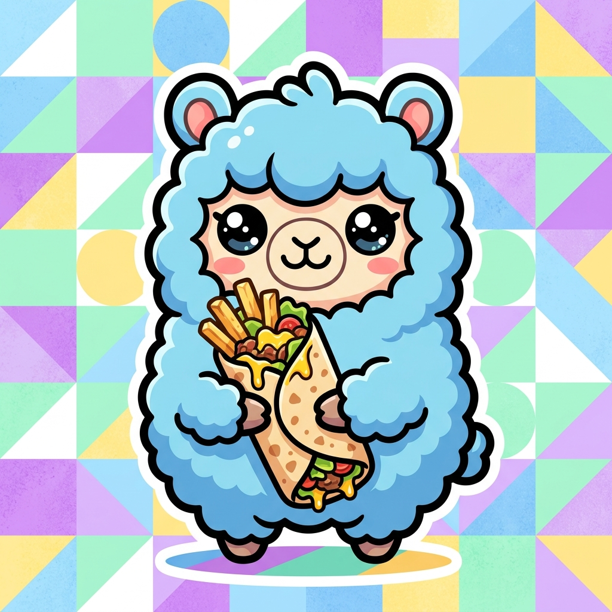

# 🌌 Anis Mselmi | Futuristic Agentic Portfolio

[](https://streamlit.io)
[](https://www.python.org/)
[](https://deepmind.google/technologies/gemini/)
[](#-ask-my-ai-twin-console)
[](#-mobile-responsive-design)

> [!NOTE]
> ### 🌐 Deployment & Hosting Details
> * **Domain Name:** [https://anismselmi.me](https://anismselmi.me)
> * **Render Host:** [https://anismselmi.onrender.com](https://anismselmi.onrender.com)
> * **Streamlit Host:** [https://streamlit.io](https://streamlit.io)


<p align="center">
  
</p>

A **premium, highly interactive personal portfolio** application showcasing a futuristic cyber-console design. Built with **Streamlit** and powered by professional vanilla CSS — featuring fluid scroll behaviors, intersection observers, glassmorphic UI components, and a custom **AI Twin RAG Terminal Console**.

---

## ✨ Features

### 🤖 Ask My AI Twin Console
An interactive developer-themed terminal mimicking a live **Retrieval-Augmented Generation (RAG)** engine.
* **Intelligent Query Parser:** Employs high-precision fuzzy keyword matching and sequence metrics to locate portfolio details instantly.
* **Developer Shell Commands:** Fully supports Unix-style console slash-commands:
  * `/about` — Introduce Anis's professional objective
  * `/skills` — Print technical stack inventory
  * `/projects` — List engineered software systems
  * `/certificates` (or `/certs`) — Output verified NVIDIA certificates registry
  * `/cv` — Print direct resume Canva URL
  * `/contact` — Display communications channels
  * `/clear` — Flush console buffer
  * `/help` — Print command registry
* **Gemini LLM Failover:** Connects dynamically with **Google Gemini 1.5 Flash** if a `GEMINI_API_KEY` is provided.
* **Suggested Prompts:** Includes fast-access click triggers to run prompt queries instantly.

---

### 🧭 7-Button Sticky Centered Navbar
* A sticky navigation bar with **7 section buttons** all displayed on a single centered line: **🛠 Skills · 🎓 Education · 📜 Certs · 🚀 Projects · 🏆 Hackathons · 🌍 Languages · 📬 Contact**
* Smooth scroll-to-section behavior with active-link highlighting via `IntersectionObserver`.
* Horizontally scrollable on mobile — all buttons remain on one line.

---

### 🛠️ Interactive Skills Showcase
* **Skill Category Grid:** Structured glassmorphic cards with interactive hover animations and custom tech tags.
* **Interactive Competence Charts:** 3 custom Plotly dark-themed charts side-by-side:
  1. *Top Skills* — Horizontal bar chart with a cyan-to-purple gradient.
  2. *Domain Mix* — Donut chart showing category distribution.
  3. *Languages* — Vertical bar chart of programming language proficiencies.

---

### 🎓 Structured Education Timeline
* **Glassmorphic Cards:** 3-column glassmorphism layout with `backdrop-filter: blur(12px)`, animated glowing borders on hover.
* **Header Badges:** Circular emoji badges with hover rotation and pill date badges.
* **Direct PDF CV Download:** Local PDF encoded in base64 and served directly to the browser.

---

### 🎖️ Verified NVIDIA Certifications Registry
* **Responsive 4-Column CSS Grid** displaying 8 professional NVIDIA Certificates of Competency.
* **Instant Verification Redirects** — each card links directly to `learn.nvidia.com` for credential verification.
* **AI Terminal Integration** — The AI Twin understands `/certificates` and `/certs` commands.

---

### 🚀 Projects Grid
* Multi-column display of core engineering projects with project image cards, tech-stack tags, and GitHub links.
* **NovaChess** project features a custom chess board image (`assets/images/projects/chess.png`).

---

### 🏆 Hackathon Wins
* Dedicated **Hackathons** section showcasing competition achievements with event photos.
* **Fixed-height cards** (325px) with prominent 160px event banner images.
* Each card displays: event name, award badge (🥇 **Top 6**, etc.), organizer, date, and tech tags.
* Gold-to-cyan gradient glassmorphic borders with animated hover lift effect.
* **IEEE WIE ACT 4.0** properly featured alongside other IEEE congresses.

---

### 🌍 Languages Section
* **Glassmorphic language cards** with circular full-bleed flag images (Arabic, English, French, Saudi flag).
* Language proficiency displayed with badge chips per card.
* 2-column responsive grid layout (3-column on wide screens).

---

### 📬 Premium Contact Section
* **Two-column layout** — contact form on the left, Contact Details card on the right.
* **Redesigned Contact Details Card:**
  - Glassmorphic dark card with `backdrop-filter: blur(12px)`.
  - Each contact row has a **color-coded glowing icon box** (blue for email, green for phone, red for location, LinkedIn blue, GitHub white).
  - **Label + Value structure** — small muted label above the actual value.
  - Smooth slide-right hover animation with border glow per row.
  - Gradient accent underline below the "Contact Details" title.
* **Contact Form** with direct email sending via SMTP and a mailto fallback.

---

### 📱 Mobile Responsive Design
* **Streamlit columns stay horizontal** on mobile — `stHorizontalBlock` is forced to `flex-direction: row` so the layout never stacks.
* **Horizontally scrollable navbar** — all 7 buttons visible in a single swipeable strip.
* **Hackathon / Project cards** maintain side-by-side layout with touch-friendly horizontal scroll.
* **Language and Certificate grids** drop to 2-column on tablet, 1-column on very small screens.
* Smooth scaling of typography (`h1`, `h2`, `h3`) and component sizes at 768px and 480px breakpoints.

---

## 🗂️ Codebase Architecture

```
portfolio/
├── app.py              # Entrypoint — page config & section orchestration
├── sections.py         # Modular component renderers (Navbar, Hero, Hackathons, Languages, Contact, etc.)
├── styles.py           # Complete responsive stylesheet (dark glassmorphic theme, animations, mobile CSS)
├── ai_agent.py         # Fuzzy intent parser & Google Gemini RAG twin engine
├── data.py             # Centralized data (profile, education, certs, projects, hackathons, languages)
├── utils.py            # Image optimization pipelines, circular masks & element wrappers
├── requirements.txt    # Python dependencies
└── assets/
    ├── CV de Anis Mselmi.pdf          # PDF Resume (base64-served for download)
    └── images/
        ├── profile/                   # Hero photo, banner
        ├── projects/
        │   └── chess.png              # NovaChess project image
        └── hackathons/                # IEEE & competition event photos
```

---

## 🚀 Getting Started

### 1. Prerequisites
Ensure you have **Python 3.10+** installed.

### 2. Installation
Clone the repository and install dependencies:
```bash
git clone https://github.com/anis-mselmi/portfolio.git
cd portfolio
pip install -r requirements.txt
```

### 3. Running the Portfolio
```bash
streamlit run app.py
```
Opens at **`http://localhost:8501`** by default.

---

## 🔑 Activating Live AI (Gemini LLM)
To upgrade the **AI Twin Console** from local fuzzy search to a live Gemini conversational agent:

1. Get a free API key from [Google AI Studio](https://aistudio.google.com/).
2. Create `.streamlit/secrets.toml`:
   ```toml
   GEMINI_API_KEY = "your_actual_api_key_here"
   ```
3. Or export it in your shell:
   ```bash
   # Windows PowerShell
   $env:GEMINI_API_KEY="your_api_key"
   # Linux / macOS
   export GEMINI_API_KEY="your_api_key"
   ```

---

## 🛠️ Customization Guide

The codebase is **fully modular** and easy to adapt:

| File | What to change |
|---|---|
| `data.py` | Profile info, projects, education, certs, hackathons, languages |
| `styles.py` | Colors, glow effects, grids, animations, mobile breakpoints |
| `sections.py` | Layout of every section, HTML structure |
| `app.py` | Section order, page config |
| `assets/` | Images, CV PDF |

---

## 📄 License
MIT — free to fork, adapt, and deploy as your own portfolio.
